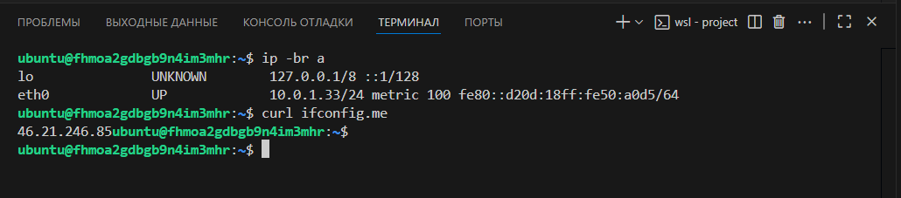

# Домашнее задание к занятию «Основы Terraform. Yandex Cloud»

### Цели задания

1. Создать свои ресурсы в облаке Yandex Cloud с помощью Terraform.
2. Освоить работу с переменными Terraform.


### Чек-лист готовности к домашнему заданию

1. Зарегистрирован аккаунт в Yandex Cloud. Использован промокод на грант.
2. Установлен инструмент Yandex CLI.
3. Исходный код для выполнения задания расположен в директории [**02/src**](https://github.com/netology-code/ter-homeworks/tree/main/02/src).


### Задание 0

1. Ознакомьтесь с [документацией к security-groups в Yandex Cloud](https://cloud.yandex.ru/docs/vpc/concepts/security-groups?from=int-console-help-center-or-nav). 
Этот функционал понадобится к следующей лекции.

------
### Внимание!! Обязательно предоставляем на проверку получившийся код в виде ссылки на ваш github-репозиторий!
------

### Задание 1
В качестве ответа всегда полностью прикладывайте ваш terraform-код в git.
Убедитесь что ваша версия **Terraform** ~>1.8.4

1. Изучите проект. В файле variables.tf объявлены переменные для Yandex provider.
2. Создайте сервисный аккаунт и ключ. [service_account_key_file](https://terraform-provider.yandexcloud.net).
4. Сгенерируйте новый или используйте свой текущий ssh-ключ. Запишите его открытую(public) часть в переменную **vms_ssh_public_root_key**.
5. Инициализируйте проект, выполните код. Исправьте намеренно допущенные синтаксические ошибки. Ищите внимательно, посимвольно. Ответьте, в чём заключается их суть.
6. Подключитесь к консоли ВМ через ssh и выполните команду ``` curl ifconfig.me```.
Примечание: К OS ubuntu "out of a box, те из коробки" необходимо подключаться под пользователем ubuntu: ```"ssh ubuntu@vm_ip_address"```. Предварительно убедитесь, что ваш ключ добавлен в ssh-агент: ```eval $(ssh-agent) && ssh-add``` Вы познакомитесь с тем как при создании ВМ создать своего пользователя в блоке metadata в следующей лекции.;
8. Ответьте, как в процессе обучения могут пригодиться параметры ```preemptible = true``` и ```core_fraction=5``` в параметрах ВМ.

В качестве решения приложите:

- скриншот ЛК Yandex Cloud с созданной ВМ, где видно внешний ip-адрес;
- скриншот консоли, curl должен отобразить тот же внешний ip-адрес;
- ответы на вопросы.


### Задание 2

1. Замените все хардкод-**значения** для ресурсов **yandex_compute_image** и **yandex_compute_instance** на **отдельные** переменные. К названиям переменных ВМ добавьте в начало префикс **vm_web_** .  Пример: **vm_web_name**.
2. Объявите нужные переменные в файле variables.tf, обязательно указывайте тип переменной. Заполните их **default** прежними значениями из main.tf. 
3. Проверьте terraform plan. Изменений быть не должно. 


### Задание 3

1. Создайте в корне проекта файл 'vms_platform.tf' . Перенесите в него все переменные первой ВМ.
2. Скопируйте блок ресурса и создайте с его помощью вторую ВМ в файле main.tf: **"netology-develop-platform-db"** ,  ```cores  = 2, memory = 2, core_fraction = 20```. Объявите её переменные с префиксом **vm_db_** в том же файле ('vms_platform.tf').  ВМ должна работать в зоне "ru-central1-b"
3. Примените изменения.


### Задание 4

1. Объявите в файле outputs.tf **один** output , содержащий: instance_name, external_ip, fqdn для каждой из ВМ в удобном лично для вас формате.(без хардкода!!!)
2. Примените изменения.

В качестве решения приложите вывод значений ip-адресов команды ```terraform output```.


### Задание 5

1. В файле locals.tf опишите в **одном** local-блоке имя каждой ВМ, используйте интерполяцию ${..} с НЕСКОЛЬКИМИ переменными по примеру из лекции.
2. Замените переменные внутри ресурса ВМ на созданные вами local-переменные.
3. Примените изменения.


### Задание 6

1. Вместо использования трёх переменных  ".._cores",".._memory",".._core_fraction" в блоке  resources {...}, объедините их в единую map-переменную **vms_resources** и  внутри неё конфиги обеих ВМ в виде вложенного map(object).  
   ```
   пример из terraform.tfvars:
   vms_resources = {
     web={
       cores=2
       memory=2
       core_fraction=5
       hdd_size=10
       hdd_type="network-hdd"
       ...
     },
     db= {
       cores=2
       memory=4
       core_fraction=20
       hdd_size=10
       hdd_type="network-ssd"
       ...
     }
   }
   ```
3. Создайте и используйте отдельную map(object) переменную для блока metadata, она должна быть общая для всех ваших ВМ.
   ```
   пример из terraform.tfvars:
   metadata = {
     serial-port-enable = 1
     ssh-keys           = "ubuntu:ssh-ed25519 AAAAC..."
   }
   ```  
  
5. Найдите и закоментируйте все, более не используемые переменные проекта.
6. Проверьте terraform plan. Изменений быть не должно.

------

## Дополнительное задание (со звёздочкой*)

**Настоятельно рекомендуем выполнять все задания со звёздочкой.**   
Они помогут глубже разобраться в материале. Задания со звёздочкой дополнительные, не обязательные к выполнению и никак не повлияют на получение вами зачёта по этому домашнему заданию. 


------
### Задание 7*

Изучите содержимое файла console.tf. Откройте terraform console, выполните следующие задания: 

1. Напишите, какой командой можно отобразить **второй** элемент списка test_list.
2. Найдите длину списка test_list с помощью функции length(<имя переменной>).
3. Напишите, какой командой можно отобразить значение ключа admin из map test_map.
4. Напишите interpolation-выражение, результатом которого будет: "John is admin for production server based on OS ubuntu-20-04 with X vcpu, Y ram and Z virtual disks", используйте данные из переменных test_list, test_map, servers и функцию length() для подстановки значений.

**Примечание**: если не догадаетесь как вычленить слово "admin", погуглите: "terraform get keys of map"

В качестве решения предоставьте необходимые команды и их вывод.

------

### Задание 8*
1. Напишите и проверьте переменную test и полное описание ее type в соответствии со значением из terraform.tfvars:
```
test = [
  {
    "dev1" = [
      "ssh -o 'StrictHostKeyChecking=no' ubuntu@62.84.124.117",
      "10.0.1.7",
    ]
  },
  {
    "dev2" = [
      "ssh -o 'StrictHostKeyChecking=no' ubuntu@84.252.140.88",
      "10.0.2.29",
    ]
  },
  {
    "prod1" = [
      "ssh -o 'StrictHostKeyChecking=no' ubuntu@51.250.2.101",
      "10.0.1.30",
    ]
  },
]
```
2. Напишите выражение в terraform console, которое позволит вычленить строку "ssh -o 'StrictHostKeyChecking=no' ubuntu@62.84.124.117" из этой переменной.
------

------

### Задание 9*

Используя инструкцию https://cloud.yandex.ru/ru/docs/vpc/operations/create-nat-gateway#tf_1, настройте для ваших ВМ nat_gateway. Для проверки уберите внешний IP адрес (nat=false) у ваших ВМ и проверьте доступ в интернет с ВМ, подключившись к ней через serial console. Для подключения предварительно через ssh измените пароль пользователя: ```sudo passwd ubuntu```

### Правила приёма работыДля подключения предварительно через ssh измените пароль пользователя: sudo passwd ubuntu
В качестве результата прикрепите ссылку на MD файл с описанием выполненой работы в вашем репозитории. Так же в репозитории должен присутсвовать ваш финальный код проекта.

**Важно. Удалите все созданные ресурсы**.


### Критерии оценки

Зачёт ставится, если:

* выполнены все задания,
* ответы даны в развёрнутой форме,
* приложены соответствующие скриншоты и файлы проекта,
* в выполненных заданиях нет противоречий и нарушения логики.

На доработку работу отправят, если:

* задание выполнено частично или не выполнено вообще,
* в логике выполнения заданий есть противоречия и существенные недостатки. 


### Решение

#### Задание 1

##### 1

##### 2

**Немного теории.**
В облаке есть ресурс или **точка входа** для **верификации** IAM. Всякий раз когда осуществляется какая-либо операция с облаком, клиент (будь то **yc** или работа через **API**) обращается к сервису **ComputeCloud** а тот в свою очередь к IAM и спрашивает у него, достоен ли сей пользователь смотреть, создавать, удалять или модифицировать конкретный ресурс. 

Вообще всё чуть проще, чем видится на первый взгляд. Всё это обилие названий: **userAccount**, **сервисный аккаунт**, **федерации удостоверений**, **группы** и **роли**... больше похоже на маркетинговую мишуру и проблемы в проектировании. Навертели всякого ребята знатно.

Внутри облака много ресурсов и не всегда в одно лицо нужно этим заниматься, следовательно нужно делегировать какую-то задачу какому-то пользователю. 

Отсюда получаем такой POV: Субъекты (они же пользователи и группы пользователей), Ресурсы (они же всякие виртуалки, сети, хранилища, и [много ещё чего](https://yandex.cloud/ru/docs/iam/concepts/access-control/resources-with-access-control)) и Роли (Примитивные: admin, editor, viewer,  auditor и Сервисные типа compute.images.user где compute.images это указатель на ресурс, а user **намёк на разрешения**) [немного сервисных ролей](https://yandex.cloud/ru/docs/iam/roles-reference)

Ну и представь себе пересечение этих 3-х множеств, получается овер много всяких комбинаций. 
Так как ресурсы выстраиваются в иерархию, то права у дочерних ресурсов наследуются от родителей.
Можно формировать группы пользователей и им задавать права. Есть две публичные группы, это All authenticated users и просто All users. Последние вообще все кто способен подёргать облако за API. 

**Из прикольного:**: 

Есть такая тема как **федерация удостоверений**, в общем, это сторонний сервер который отвечает за **аутентификацию**. Может быть AD или [чем-то ещё](https://yandex.cloud/ru/docs/organization/concepts/add-federation)

**Сервисный аккаунт**. В общем, это неперсонифицированная учётка, на самом деле [Ресурс](https://yandex.cloud/ru/docs/iam/concepts/users/service-accounts), для всяких terraform-ов. Используя её, можно работать с облаком изнутри [виртуальной машины развернутой в облаке](https://yandex.cloud/ru/docs/compute/operations/vm-connect/auth-inside-vm)

**Аутентификация** Смотри [тут](https://yandex.cloud/ru/docs/iam/concepts/authorization/) но для наших целей подойдут два способа:

[OAuth - токен](https://yandex.cloud/ru/docs/iam/concepts/authorization/oauth-token) если мы планируем работать от имени пользователя (его нет у федеративных пользователей и сервисных аккаунтов).

[IAM-токен](https://yandex.cloud/ru/docs/iam/concepts/authorization/iam-token)
подходит для **аутентификации** сервисных аккаунтов и пользователей [так написано](https://yandex.cloud/ru/docs/iam/concepts/authorization/iam-token). 

[Авторизованные ключи](https://yandex.cloud/ru/docs/iam/concepts/authorization/key)

Но тут смысл какой, для получения **IAM-токена** нужен **OAuth - токен** или **авторизованный ключ**, а для последнего нужен **Аккаунт на Яндексе**

Можно и иначе получать **IAM-токена** через всякие [иные места](https://yandex.cloud/ru/docs/iam/concepts/authorization/) и обмен токена на токен.

##### 3

Просто укажем путь на ключ для виртуалок.
Пара слов об инициализации. Мы имеем запись вида 
```
variable "vms_ssh_root_key" {
  type        = string
  default     = "~/.ssh/id_ed25519.pub"
  description = "ssh-keygen -t ed25519"
}
```
а в описании ВМ 
```   
metadata = {
    serial-port-enable = 1
    ssh-keys           = "ubuntu:${file(var.vms_ssh_root_key)}"
  }
```
фаактически запись можно представить в виде ssh-keys = "ubuntu:${file(~/.ssh/id_ed25519.pub)}"

Здесь 
``` ubuntu ``` -  имя пользователя
``` ${} ``` -  интерполяция, то есть вставка в текст значения которое будет вычислено 
``` file ``` -  читает содержимое файла

Но что интересно, в файле **authorized_keys** в начале записи нет имени пользователя: 
```
ubuntu@fhmoa2gdbgb9n4im3mhr:~$ cat ~/.ssh/authorized_keys 
ssh-ed25519 AAAAC3NzaC1lZDI1NTE5A...
```

##### 4

###### Очепятки:
В main.tf в блоке 
```
resource "yandex_compute_instance" "platform" {
  name        = "netology-develop-platform-web"
  platform_id = "standart-v4"
```
Изменить **platform_id = "standart-v4"** на **platform_id = "standard-v1"** [список платформ](https://yandex.cloud/ru/docs/compute/concepts/vm-platforms)
и в блоке 
```
  resources {
    cores         = 1

```
Изменить количество ядер, для платформы standart-v1 **cores = 1** заменить на **cores = 2** или **cores = 4**

##### 5



##### 6

**Preemptible** — это флаг, который указывает на использование прерываемых виртуальных машин (ВМ) в сервисе Yandex Compute Cloud [в помощь](https://yandex.cloud/ru/docs/data-proc/operations/cluster-create)

**core-fraction** — базовая производительность vCPU в %. [в помощь](https://yandex.cloud/ru/docs/tutorials/infrastructure-management/packer-custom-image)

Все эти вещи позволяют сильно сэкономить в облаке :)

#### Задание 2

##### 1

Добавлены 4 переменные

**vm_web_name**
**vm_web_platform_id**
**vm_web_image_family**
**vm_web_resources**

##### 2


##### 3


#### Задание 3

Задание больше на аккуратность, в проект добавил файл [vms_platform.tf](src/vms_platform.tf). Но я в который раз замечаю об избыточности при описании ресурсов. Для того, чтобы посадить вторую ВМ в другую подсеть, ей не только пришлось указать ```
network_interface {
    subnet_id
    ```
но и в описании самой машины указать зону:
```
resource "yandex_compute_instance" "db" {
  name        = var.vm_db_name
  platform_id = var.vm_db_platform_id
  zone        = var.vm_db_zone
```

ну и зачем? А без этого задвоенного указания получал ошибку в проекте. На самом деле такое часто встречается, с тем же сервисным аккаунтом, всегда нужно указывать облако и папку для tf драйвера, зачем, если я токен выпускаю на определенный ресурс? В общем сыро немного или избыточно, от того можно с ошибкой какой-то сидеть и тупить пол-дня.

#### Задание 4
